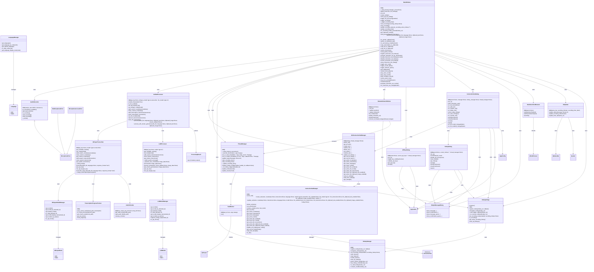

# プロジェクト全体 クラス依存関係図（Mermaid形式）

```mermaid
classDiagram
    %% --- core ---
    class UnifiedProcessor {
        +__init__(api_key=None, whisper_model="gpt-4o-transcribe", llm_model="gpt-4o")
        +enable_llm(enabled=True)
        +is_llm_enabled()
        +set_api_key(api_key)
        +set_whisper_model(model)
        +add_custom_vocabulary(vocabulary)
        +clear_custom_vocabulary()
        +add_transcription_instruction(instructions)
        +clear_transcription_instructions()
        +set_llm_model(model)
        +add_llm_instruction(instructions)
        +clear_llm_instructions()
        +process(audio_file, language=None, clipboard_text=None, clipboard_image=None, stream_callback=None)
        +process_with_stream_generator(audio_file, language=None, clipboard_text=None, clipboard_image=None)
    }
    class ProcessingResult {
        +get_formatted_output()
    }
    class WhisperTranscriber {
        +__init__(api_key=None, model="gpt-4o-transcribe")
        +get_available_models()
        +set_model(model)
        +add_custom_vocabulary(vocabulary)
        +clear_custom_vocabulary()
        +get_custom_vocabulary()
        +add_system_instruction(instructions)
        +clear_system_instructions()
        +get_system_instructions()
        +_build_prompt()
        +transcribe(audio_file, language=None, response_format="text")
        +get_api_key()
        +set_api_key(api_key)
        +transcribe_large_file(audio_file, language=None, response_format="text")
        +_merge_transcriptions(transcriptions)
    }
    class LLMProcessor {
        +__init__(api_key=None, model="gpt-4o")
        +get_available_models()
        +set_model(model)
        +add_system_instruction(instructions)
        +clear_system_instructions()
        +get_system_instructions()
        +_build_system_message()
        +_prepare_user_content(text, image_data=None)
        +process(text, image_data=None)
        +process_stream(text, chunk_callback=None, image_data=None)
        +get_stream_generator(text, image_data=None)
        +get_api_key()
        +set_api_key(api_key)
    }
    class AudioRecorder {
        +__init__(sample_rate=16000, channels=1)
        +is_microphone_available()
        +get_input_devices()
        +is_recording()
        +start_recording()
        +stop_recording()
        +_record()
    }
    class MicrophoneError
    class NoMicrophoneError
    class MicrophoneAccessError
    class AudioChunker {
        +__init__(max_chunk_size_mb=20.0, temp_dir=None)
        +get_audio_duration(file_path)
        +split_audio_file(file_path)
        +cleanup_chunks()
    }
    class TranscriptionProgressTracker {
        +__init__()
        +save_chunk_result(chunk_path, transcription)
        +is_chunk_processed(chunk_path)
        +get_chunk_result(chunk_path)
        +get_all_results()
        +reset_progress()
    }
    class InstructionSetManager {
        +__init__()
        +active_set()
        +create_set(name, vocabulary=None, instructions=None, language=None, model="gpt-4o-transcribe", llm_enabled=False, llm_model="gpt-4o", llm_instructions=None, llm_clipboard_text_enabled=False, llm_clipboard_image_enabled=False, hotkey="")
        +update_set(name, vocabulary=None, instructions=None, language=None, model=None, llm_enabled=None, llm_model=None, llm_instructions=None, llm_clipboard_text_enabled=None, llm_clipboard_image_enabled=None, hotkey=None)
        +delete_set(name)
        +set_active(name)
        +rename_set(old_name, new_name)
        +get_all_sets()
        +get_active_vocabulary()
        +get_active_instructions()
        +get_active_language()
        +get_active_model()
        +get_active_llm_enabled()
        +get_active_llm_model()
        +get_active_llm_instructions()
        +get_active_llm_clipboard_text_enabled()
        +get_active_llm_clipboard_image_enabled()
        +update_set_hotkey(name, hotkey)
        +get_set_by_hotkey(hotkey)
        +load_from_dict(data)
        +to_dict()
    }
    class InstructionSet {
        <<dataclass>>
    }
    class HotkeyManager {
        +__init__()
        +register_hotkey(hotkey_str, callback)
        +unregister_hotkey(hotkey_str)
        +set_recording_mode(enabled, recording_hotkey=None)
        +start_listener()
        +stop_listener()
        +restart_listener()
        +clear_all_hotkeys()
        +parse_hotkey_string(hotkey_str)
        +has_hotkey_conflict(hotkey_str)
        +is_valid_hotkey(hotkey_str)
        +contains_modifier(hotkey_str)
    }
    %% --- core/models ---
    class WhisperModel {
        +__str__()
        +__repr__()
    }
    class WhisperModelManager {
        +get_models()
        +get_model_by_id(model_id)
        +get_default_model()
        +is_valid_id(model_id)
        +get_model_display_name(model_id)
        +get_models_by_tier(tier)
        +to_api_format()
    }
    class LLMModel {
        +__str__()
        +__repr__()
    }
    class LLMModelManager {
        +get_models()
        +get_model_by_id(model_id)
        +get_default_model()
        +is_valid_id(model_id)
        +get_model_display_name(model_id)
        +get_models_by_tier(tier)
        +supports_image_input(model_id)
        +to_api_format()
    }
    class Language {
        +__str__()
        +__repr__()
    }
    class LanguageManager {
        +get_languages()
        +get_language_by_code(code)
        +get_default_language()
        +is_valid_code(code)
        +get_language_display_name(code)
    }
    %% --- gui/windows ---
    class MainWindow {
        +__init__()
        +_setup_thread_manager_connections()
        +apply_instruction_set_settings()
        +init_ui()
        +create_toolbar()
        +show_api_key_dialog()
        +toggle_llm_processing(enabled)
        +toggle_recording()
        +_toggle_recording_impl()
        +start_recording(recording_hotkey=None)
        +stop_recording()
        +update_recording_status(is_recording, active_hotkey="")
        +update_recording_time()
        +on_recording_hotkey_pressed(hotkey_str)
        +get_clipboard_content()
        +start_processing(audio_file=None)
        +perform_processing(audio_file, language=None, clipboard_text=None, clipboard_image=None)
        +on_stream_update(chunk)
        +switch_to_markdown_tab()
        +on_processing_complete(result)
        +copy_transcription_to_clipboard()
        +copy_llm_to_clipboard()
        +copy_all_to_clipboard()
        +setup_connections()
        +setup_global_hotkey()
        +register_instruction_set_hotkeys()
        +activate_instruction_set_by_name(name)
        +handle_instruction_set_hotkey(set_name)
        +disable_instruction_set_hotkeys()
        +restore_instruction_set_hotkeys()
        +show_instruction_sets_dialog()
        +toggle_auto_copy()
        +toggle_sound_option()
        +toggle_indicator_option()
        +quit_application()
        +setup_sound_players()
        +play_start_sound()
        +play_stop_sound()
        +play_complete_sound()
        +setup_system_tray()
        +tray_icon_activated(reason)
        +closeEvent(event)
        +populate_instruction_set_combo()
        +on_instruction_set_changed(index)
    }
    %% --- gui/dialogs ---
    class GUIInstructionSetManager {
        +__init__(settings, thread_manager=None)
        +active_set()
        +get_all_sets()
        +create_set(...)
        +update_set(...)
        +delete_set(...)
        +set_active(...)
        +rename_set(...)
        +update_set_hotkey(...)
        +get_set_by_hotkey(...)
        +get_set_by_name(...)
        +get_active_vocabulary()
        +get_active_instructions()
        +get_active_language()
        +get_active_model()
        +get_active_llm_enabled()
        +get_active_llm_model()
        +get_active_llm_instructions()
        +get_active_llm_clipboard_text_enabled()
        +get_active_llm_clipboard_image_enabled()
        +save_to_settings()
        +load_from_settings()
        +get_manager()
    }
    class InstructionSetsDialog {
        +__init__(parent=None, manager=None, hotkey_manager=None, thread_manager=None)
        +init_ui()
        +load_instruction_sets()
        +on_set_selected(row)
        +on_add_set()
        +on_rename_set()
        +on_delete_set()
        +show_hotkey_dialog()
        +on_save_changes()
        +on_activate_set()
        +showEvent(event)
        +closeEvent(event)
        +accept()
        +reject()
        +on_llm_model_changed(index)
        +on_llm_enabled_changed(state)
    }
    class SimpleMessageDialog {
        +show_message(...)
        +show_confirmation(...)
        +show_message_async(...)
        +show_confirmation_async(...)
    }
    class APIKeyDialog {
        +__init__(parent=None, current_api_key="", thread_manager=None)
        +init_ui()
        +toggle_key_visibility(checked)
        +validate_api_key()
        +get_api_key()
        +accept()
    }
    class HotkeyDialog {
        +__init__(parent=None, current_hotkey="", thread_manager=None)
        +init_ui()
        +eventFilter(obj, event)
        +handle_key_press(event)
        +reset_hotkey()
        +get_hotkey()
        +accept()
        +showEvent(event)
        +closeEvent(event)
        +reject()
    }
    %% --- gui/components/widgets ---
    class StatusIndicatorWindow {
        +__init__(parent=None)
        +_init_ui()
        +_update_position()
        +_update_indicator()
        +set_mode(mode)
        +update_timer(time_str)
        +showEvent(event)
        +connect_to_thread_manager(thread_manager)
    }
    class MarkdownTextBrowser {
        +__init__(parent=None)
        +setMarkdownText(text)
        +setPlaceholderText(text)
        +sizeHint()
    }
    %% --- gui/thread_management ---
    class ThreadManager {
        +__init__()
        +_setup_internal_connections()
        +_execute_function(func, args, kwargs)
        +run_in_main_thread(func, *args, delay_ms=0, **kwargs)
        +run_in_worker_thread(task_id, func, *args, callback=None, **kwargs)
        +update_status(message, timeout=0)
        +start_recording_timer()
        +stop_recording_timer()
        +_update_recording_time()
        +register_hotkey_handler(hotkey, handler_id, callback=None)
        +_on_hotkey_triggered(handler_id)
        +update_indicator(mode)
        +update_stream(chunk)
    }
    class UIUpdater {
        +__init__(status_bar, recording_indicator, recording_timer_label)
        +update_status(message, timeout=0)
        +update_recording_indicator(text)
        +update_timer_label(time_str)
    }
    class HotkeyBridge {
        +instance()
        +__init__()
        +register_hotkey(hotkey_str, callback)
        +unregister_hotkey(hotkey_str)
        +_safe_trigger_callback(hotkey_str)
        +_on_execute_callback(hotkey_str)
        +set_recording_mode(enabled, recording_hotkey=None)
        +is_recording()
        +get_active_recording_hotkey()
        +clear_all_hotkeys()
    }
    class TaskWorker {
        +__init__(task_id, func, args, kwargs)
        +run()
    }
    %% --- gui/resources ---
    class AppLabels
    class AppConfig

    %% --- 依存関係 ---
    UnifiedProcessor --> WhisperTranscriber : uses
    UnifiedProcessor --> LLMProcessor : uses
    UnifiedProcessor --> ProcessingResult : returns
    WhisperTranscriber --> WhisperModelManager : uses
    WhisperTranscriber --> TranscriptionProgressTracker : uses
    WhisperTranscriber --> AudioChunker : uses
    LLMProcessor --> LLMModelManager : uses
    InstructionSetManager --> InstructionSet : manages
    WhisperModelManager --> WhisperModel : manages
    LLMModelManager --> LLMModel : manages
    LanguageManager --> Language : manages
    AudioRecorder <|-- MicrophoneError
    NoMicrophoneError --|> MicrophoneError
    MicrophoneAccessError --|> MicrophoneError

    MainWindow --> AudioRecorder : uses
    MainWindow --> UnifiedProcessor : uses
    MainWindow --> GUIInstructionSetManager : uses
    MainWindow --> ThreadManager : uses
    MainWindow --> HotkeyManager : uses
    MainWindow --> StatusIndicatorWindow : uses
    MainWindow --> APIKeyDialog : uses
    MainWindow --> InstructionSetsDialog : uses
    MainWindow --> SimpleMessageDialog : uses
    MainWindow --> MarkdownTextBrowser : uses
    MainWindow --> UIUpdater : uses
    MainWindow --> HotkeyBridge : uses

    GUIInstructionSetManager --> InstructionSetManager : wraps
    InstructionSetsDialog --> GUIInstructionSetManager : uses
    InstructionSetsDialog --> HotkeyDialog : uses
    InstructionSetsDialog --> SimpleMessageDialog : uses
    InstructionSetsDialog --> HotkeyBridge : uses
    InstructionSetsDialog --> AppLabels : uses
    InstructionSetsDialog --> AppConfig : uses

    APIKeyDialog --> SimpleMessageDialog : uses
    APIKeyDialog --> AppLabels : uses

    HotkeyDialog --> SimpleMessageDialog : uses
    HotkeyDialog --> HotkeyBridge : uses
    HotkeyDialog --> AppLabels : uses

    StatusIndicatorWindow --> AppLabels : uses
    StatusIndicatorWindow --> ThreadManager : connects

    MarkdownTextBrowser --> QTextBrowser : inherits

    ThreadManager --> TaskWorker : uses
    ThreadManager --> HotkeyBridge : uses

    UIUpdater --> QStatusBar : uses
    UIUpdater --> QLabel : uses

    HotkeyBridge --> HotkeyManager : uses

    TaskWorker --> QThread : inherits
```

---

- この図はプロジェクト全体（core層・GUI層・thread_management・resources・components等）の全クラス・全メソッドの依存関係を統合して表しています。
- さらに詳細な依存関係や他ディレクトリの追加が必要な場合はご指示ください。
