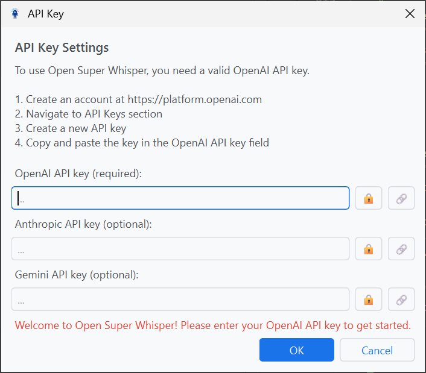
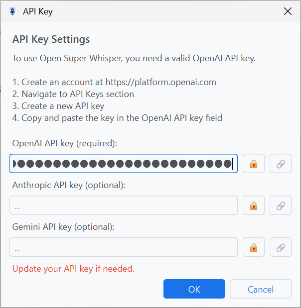

[English](README.md) | [日本語](README_ja.md) | **README**  
[English](MANUAL.md) | [日本語](MANUAL_ja.md) | **User Manual**

# Open Super Whisper V2 - User Manual

Open Super Whisper V2 is an innovative desktop application that transforms your voice into action through AI-powered agents. This comprehensive guide walks you through setup, configuration, and effective usage of this powerful voice-to-action tool.

## 📋 Table of Contents

1. [Configuration Setup](#configuration-setup)
2. [Initial Startup Screen](#initial-startup-screen)
3. [Main Window](#main-window)
4. [API Key Screen](#api-key-screen)
5. [Instruction Sets Screen](#instruction-sets-screen)
6. [Settings Screen](#settings-screen)
7. [System Tray](#system-tray)
8. [Usage Examples](#usage-examples)
9. [Troubleshooting](#troubleshooting)

## Configuration Setup

**Important:** Configuration setup should be performed when the application is not running.

### Sample Usage

Sample configuration files are provided in the `docs/` directory:

- `settings_sample_en.json` - English version with pre-configured instruction sets
- `settings_sample_ja.json` - Japanese version with the same functionality

To use a sample configuration file:

1. Create a directory in your user home directory as follows:

   ```bash
   mkdir ~/.open_super_whisper
   ```

2. Copy the sample configuration file to the created directory:

   ```bash
   cp docs/settings_sample/settings_en.json ~/.open_super_whisper/settings.json
   ```

**Note:** The application expects the settings file to be located at `~/.open_super_whisper/settings.json` (where `~` represents your user home directory).

### Sample Content

The sample configuration files include the following instruction sets:

- **Transcription Agent** (Ctrl+Shift+1) - Basic speech-to-text conversion
- **Document Creation Agent** (Ctrl+Shift+2) - Automatically convert speech to formal written documents
- **Search Keywords Agent** (Ctrl+Shift+3) - Auto-generate optimal search keywords from speech
- **Text Q&A Agent** (Ctrl+Shift+4) - Analyze clipboard text and answer questions (with web search)
- **Image Q&A Agent** (Ctrl+Shift+5) - Analyze clipboard images and answer questions (with web search)
- **Web Automation Agent** (Ctrl+Shift+6) - Autonomous web interactions using Playwright

## Initial Startup Screen

When you first launch the application, you'll see the OpenAI API key setup screen:



This is the "wakeup screen" that automatically appears when no valid OpenAI API key is configured.

### API Key Setup Steps

1. Create an account at [OpenAI Platform](https://platform.openai.com)
2. Navigate to the API Keys section
3. Create a new API key
4. Copy and paste the key into the field below
5. Click the **OK** button to complete setup

**Important**: You cannot start the application without entering a valid API key.

## Main Window


### Screen Layout

#### 📊 Top Toolbar

- **API Key** - Configure or update your API key
- **Instruction Sets** - Manage AI agent configurations
- **Settings** - General application settings
- **Quit Application** - Exit the application

#### 🎤 Recording Control Area

- **Recording Button**:
  - Idle state: **Start Recording**
  - Recording: **Stop Recording**
  - Processing: **Cancel Processing**
- **Instruction Set Selection**: Dropdown menu to choose which agent to use

#### 📋 Results Display Area (Tabbed)

**STT Output Tab**:

- Displays speech recognition results
- "Copy" button in the top right to copy results to clipboard

**LLM Output Tab**:

- Shows AI agent processing results
- "Copy" button in the top right to copy results to clipboard

#### 📊 Bottom Status Bar

- Shows current state: "Ready", "Recording...", "Processing..."
- Displays temporary messages upon completion

### Basic Operations

#### 🎤 Voice Recording Steps

1. Select an **Instruction Set** (e.g., "Transcription Agent") and click **"Start Recording"** or press your configured **hotkey**
2. Speak clearly into your microphone
3. Click **"Stop Recording"** or press the **hotkey** again
4. Review transcription results in the STT Output tab
5. View AI-processed results in the LLM Output tab

#### ⚡ Hotkey Usage

- Configure individual hotkeys for each instruction set
- Available globally from any application
- Examples: `ctrl+shift+1` (transcription), `ctrl+shift+2` (document creation), ...

## API Key Screen



### 🔑 OpenAI API Key

1. Create an account at [OpenAI Platform](https://platform.openai.com/api-keys)
2. Generate an API key
3. Enter it in the application's API key configuration screen

### 🔒 Security Notes

- Keep your API key secure
- Never share it with others
- Update it regularly

## Instruction Sets Screen

Instruction Sets define how AI agents process your voice input. You can create and customize multiple sets for different purposes.

### Instruction Sets Management Screen


#### 📁 Left Panel: Instruction Sets List

#### 🔧 Bottom Left Operation Buttons

- **Add** - Create a new instruction set
- **Rename** - Change the name of selected set
- **Delete** - Remove selected set

#### ⚙️ Right Panel: Detailed Settings (Tabbed)

Manage detailed settings for each instruction set across 5 tabs.

#### 🔧 **Bottom Right Operation Buttons**

- **Save Changes**: Save configuration changes
- **Discard Changes**: Cancel changes and revert
- **Close**: Close the dialog

### 1. Settings Tab


#### 🎤 **STT Language**

- Select speech recognition target language (e.g., Auto-detect)
- Auto-detect automatically identifies the spoken language

#### 🤖 **STT Model**

- Choose OpenAI Whisper model
- Available: GPT-4o Transcribe and others

#### ⌨️ **Hotkey**

- Global hotkey specific to each instruction set
- Example: `ctrl+shift+6`
- Click "Setting" button to change key combination

#### 🔄 **LLM Processing**

- Toggle checkbox to enable/disable LLM post-processing

#### 🤖 **LLM Model**

- Select language model to use (e.g., GPT-4.1)

#### 🌐 **Web Search**

- Enable/disable search functionality

#### 📋 **Context**

- **Include Clipboard Text** - Process text data along with speech transcription in LLM
- **Include Clipboard Image** - Process image data along with speech transcription in LLM

### 2. MCP Servers Tab


#### 🔌 **MCP Server Configuration**

- Configure Model Context Protocol (MCP) servers in JSON format
- Example configuration: Playwright Web Automation

```json
{
  "mcpServers": {
    "playwright": {
      "command": "npx",
      "args": ["@playwright/mcp@latest"]
    }
  }
}
```

### 3. LLM Instructions Tab


#### 🤖 **LLM Instructions**

- Define detailed system prompts for AI agent behavior
- Specify how to process transcription results
- Example configuration: Web Automation Agent

```
Perform web automation tasks based on the instructions in <speech_to_text>.

Use the Playwright tools to navigate websites, interact with elements, fill forms, click buttons, and extract information as requested. Provide clear feedback about each action taken and any results obtained. If a task cannot be completed, explain why and suggest alternatives.
```

#### 💡 **Available Tags**

- **<speech_to_text>**: Transcribed text from speech
- **<clipboard_text>**: Text from clipboard (only available when context checkbox is enabled)

### 4. STT Instructions Tab


#### 📝 **STT Instructions Configuration**

- Provide detailed instructions for speech recognition processing
- Specify formatting and transcription guidelines

### 5. Vocabulary Tab


#### 🔤 **Custom Vocabulary**

- Add technical terms and proper nouns to improve recognition accuracy
- Use cases:
  - **Technical terms**: Industry-specific jargon, abbreviations
  - **Proper nouns**: Names of people, places, companies, products
  - **Frequent words**: Commonly used special words or expressions
  - **Foreign words**: Non-English terms used frequently

## Settings Screen


### 🎵 **Notify with sound**

- Enable/disable audio notifications for recording start, stop, and processing completion

### 📊 **Show status indicator**

- Enable/disable visual indicators during recording and processing

### 📋 **Copy results to clipboard automatically**

- Automatic clipboard copy feature for AI processing results
- When enabled: Output is automatically copied to clipboard upon processing completion for immediate use in other applications

### 🌐 **Application Language**

- Select interface display language

## System Tray


The application runs in the system tray, providing quick access to all features:

### 🖱️ Left Click

- **Single click** - Show main window

### 🖱️ Right Click Menu

- **Show Window** - Display main window
- **Hide Window** - Hide main window (continues running in background)
- **Start Recording** / **Stop Recording** / **Cancel Processing** - Changes dynamically based on state
- **Quit Application** - Completely exit the application

## Usage Examples

### 📝 Example 1: Written Form Agent (ctrl+shift+2)

1. **Scenario**: Convert meeting voice notes into formal minutes
2. **Operation**:
   - Select "Written Form Agent" in Instruction Set dropdown
   - Press hotkey `ctrl+shift+2` or click recording button
   - Say: "Create formal meeting minutes for today's product planning discussion about development timeline and budget allocation"
   - Press hotkey again or click stop recording button
3. **Results**:
   - **STT Output**: Voice converted to text
   - **LLM Output**: Structured formal meeting minutes generated
   - Automatically copied to clipboard (if enabled)
4. **Application**: Paste into Word or Notion for meeting documentation

### 🔍 Example 2: Image Q&A Agent (ctrl+shift+5)

1. **Scenario**: Analyze a screenshot of a chart with voice questions
2. **Operation**:
   - Take a screenshot of graph or chart and copy to clipboard
   - Select "Image Q&A Agent" in Instruction Set
   - Ensure "Include Clipboard Image" is enabled
   - Press hotkey `ctrl+shift+5`
   - Say: "Analyze this sales graph trends and suggest strategies for next month"
3. **Results**:
   - AI analyzes image content
   - Detailed analysis report with specific recommendations based on graph data
4. **Application**: Use for presentations and strategic decision making

### 🌐 Example 3: Web Automation Agent (ctrl+shift+6)

1. **Scenario**: Automatically gather latest industry information
2. **Operation**:
   - Select "Web Automation Agent" in Instruction Set
   - Verify Playwright is configured in MCP servers
   - Press hotkey `ctrl+shift+6`
   - Say: "Search for latest AI industry news and summarize the three most important topics this week"
3. **Results**:
   - Playwright automatically navigates multiple websites
   - Collects and analyzes latest news
   - Generates summary report ranked by importance
4. **Application**: Use for weekly reports and market trend analysis

## Troubleshooting

### Voice Not Recognized

- **Check microphone**: Verify microphone is working in device settings
- **Check permissions**: Ensure application has microphone access permission
- **Reduce noise**: Try recording in a quieter environment

#### API Errors

- **Verify API key**: Check that correct API key is configured
- **Check quota**: Verify you haven't reached API usage limits
- **Check network**: Ensure stable internet connection

#### Hotkeys Not Working

- **Check conflicts**: Ensure no other applications use the same hotkey
- **Admin rights**: Run application with administrator privileges if needed
- **Key configuration**: Verify hotkeys are properly configured in settings
