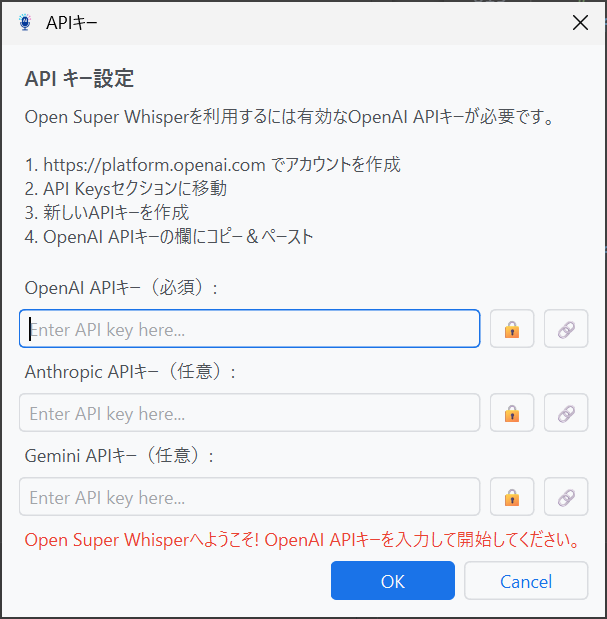
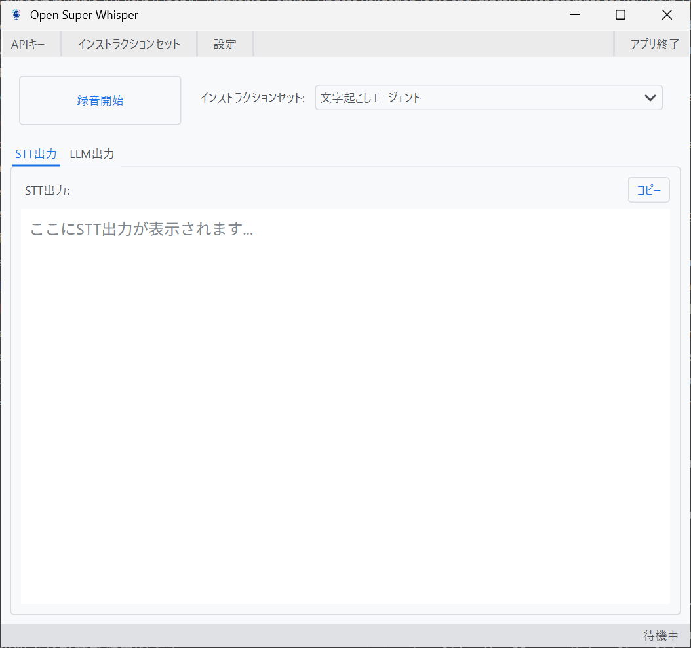
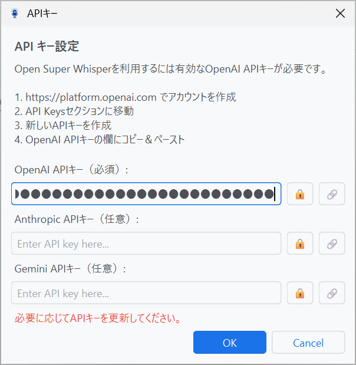
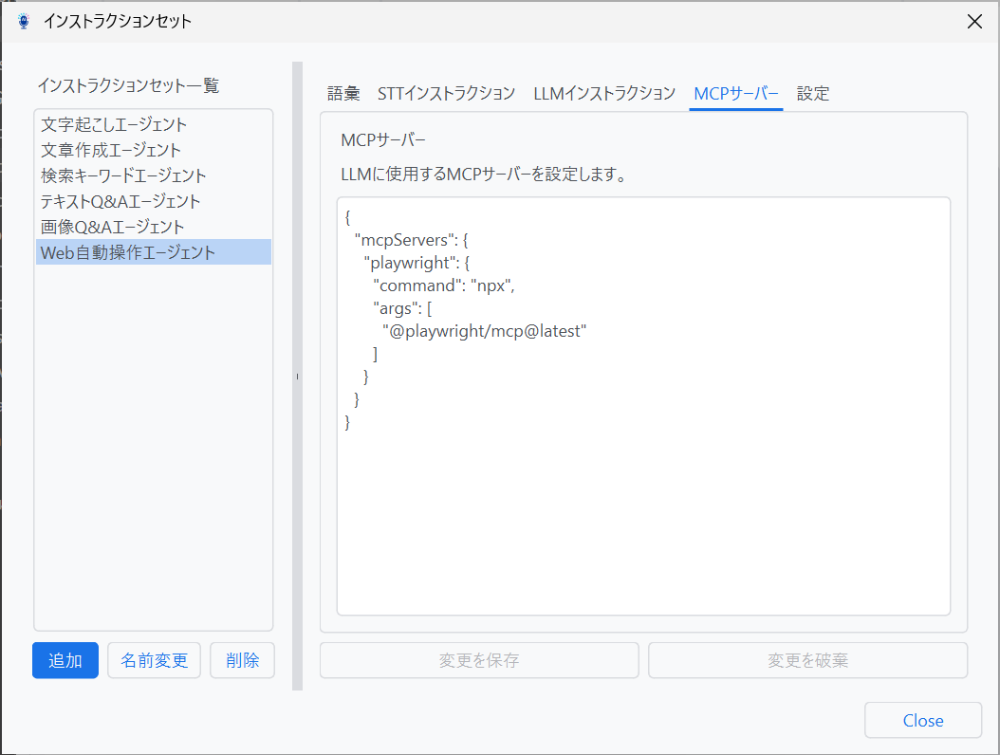
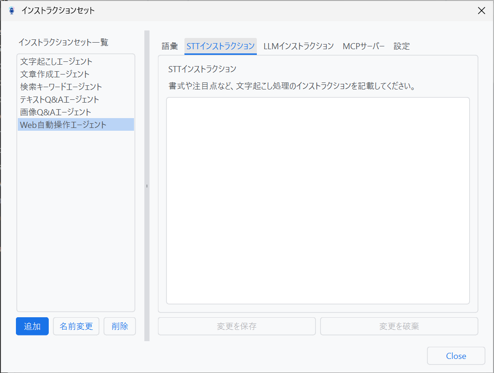

[English](README.md) | [日本語](README_ja.md) | **README**  
[English](MANUAL.md) | [日本語](MANUAL_ja.md) | **説明書**

# Open Super Whisper V2 - 説明書

Open Super Whisper V2 は、音声入力から AI エージェントによる自動処理まで、すべてをシンプルな操作で実現する革新的なデスクトップアプリケーションです。このガイドでは、初回セットアップから実際の使用方法まで、ステップバイステップで詳しく説明します。

[Open Super Whisper V2 の最新リリースをダウンロード](https://github.com/TakanariShimbo/open-super-whisper-v2/releases/latest)

## 📋 目次

1. [コンフィグ設定](#コンフィグ設定)
2. [自動起動設定](#自動起動設定)
3. [初回起動画面](#初回起動画面)
4. [メイン画面](#メイン画面)
5. [API キー画面](#api-キー画面)
6. [インストラクションセット画面](#インストラクションセット画面)
7. [設定画面](#設定画面)
8. [システムトレイ](#システムトレイ)
9. [実際の使用例](#実際の使用例)
10. [トラブルシューティング](#トラブルシューティング)

## コンフィグ設定

**重要:** コンフィグ設定はアプリケーションが起動していない時に実施してください。

### サンプルの利用

`docs/`ディレクトリにサンプルの設定ファイルが提供されています：

- `settings_sample_en.json` - 事前設定されたインストラクションセット付きの英語版
- `settings_sample_ja.json` - 同じ機能の日本語版

サンプルの設定ファイルを使用するには：

1. ユーザーホームディレクトリに以下のようにディレクトリを作成：

   ```bash
   mkdir ~/.open_super_whisper
   ```

2. サンプルの設定ファイルを作成したディレクトリにコピー：

   ```bash
   cp docs/settings_sample/settings_ja.json ~/.open_super_whisper/settings.json
   ```

**注意:** アプリケーションは設定ファイルが`~/.open_super_whisper/settings.json`に配置されることを期待しています（`~`はユーザーホームディレクトリを表します）。

### サンプルの内容

サンプルの設定ファイルには以下のインストラクションセットが含まれています：

- **文字起こしエージェント** (Ctrl+Shift+1) - 基本的な音声テキスト変換
- **文章作成エージェント** (Ctrl+Shift+2) - 音声を正式な書面に自動変換
- **検索キーワードエージェント** (Ctrl+Shift+3) - 音声から最適な検索キーワードを自動生成
- **テキスト Q&A エージェント** (Ctrl+Shift+4) - クリップボードテキストを分析して質問に回答（Web 検索対応）
- **画像 Q&A エージェント** (Ctrl+Shift+5) - クリップボード画像を解析して質問に回答（Web 検索対応）
- **Web 自動操作エージェント** (Ctrl+Shift+6) - Playwright を使用した自律的 Web 操作

## 自動起動設定

Open Super Whisper V2 を PC 起動時に自動的に開始するようにするには：

### Windows での自動起動設定

1. `OpenSuperWhisper.exe` 実行ファイルをビルドまたは取得
2. 実行ファイルを適切な場所にコピー（例：`C:\Program Files\OpenSuperWhisper\`）
3. `Win + R` を押して「ファイル名を指定して実行」ダイアログを開く
4. `shell:startup` と入力し Enter を押してスタートアップフォルダを開く
5. このフォルダに `OpenSuperWhisper.exe` のショートカットを作成：
   - スタートアップフォルダ内で右クリック
   - 「新規作成」→「ショートカット」を選択
   - `OpenSuperWhisper.exe` の場所を参照
   - 「次へ」「完了」をクリック

**注意:** アプリケーションはシステムトレイで起動し、グローバルホットキーの操作が可能になります。

### その他のショートカット配置場所

便利な場所にショートカットを作成することもできます：

**タスクバー（タスクバーにピン留め）:**

1. デスクトップショートカットまたは実行ファイルを右クリック
2. 「タスクバーにピン留めする」を選択

**スタートメニュー:**

3. `Win + R` を押し、`shell:programs` と入力して Enter を押す
4. このフォルダに `OpenSuperWhisper.exe` のショートカットを作成

**クイックアクセスツールバー:**

1. 実行ファイルまたはショートカットを PATH 内のフォルダにコピー
2. または `C:\ProgramData\Microsoft\Windows\Start Menu\Programs` にショートカットを作成

## 初回起動画面

アプリケーションを初回起動すると、OpenAI API キー設定画面が表示されます：



この画面は、有効な OpenAI API キーが設定されていない場合に自動的に表示される「ウェイクアップ画面」です。

### API キーの設定手順

1. [OpenAI Platform](https://platform.openai.com) でアカウントを作成
2. API Keys セクションに移動
3. 新しい API キーを作成
4. 下の欄にキーをコピー&ペースト
5. **「OK」ボタン**をクリックして設定完了

**重要**: 有効な API キーを入力しないとアプリケーションを開始できません。

## メイン画面



### 画面構成

#### 📊 上部ツールバー

- **API キー** - API キーの設定・変更
- **インストラクションセット** - 各 AI エージェントの動作設定管理
- **設定** - アプリケーション全般の設定
- **アプリ終了** - アプリケーション終了

#### 🎤 録音コントロールエリア

- **録音ボタン**:
  - 待機時：**録音開始**
  - 録音中：**録音停止**
  - 処理中：**処理中止**
- **インストラクションセット選択**: ドロップダウンメニューで使用するエージェントを選択

#### 📋 結果表示エリア（タブ形式）

**STT 出力タブ**:

- 音声認識結果をレンダリング
- 右上の「コピー」ボタンで結果をクリップボードにコピー

**LLM 出力タブ**:

- AI エージェントの処理結果をレンダリング
- 右上の「コピー」ボタンで結果をクリップボードにコピー

#### 📊 下部ステータスバー

- 現在の状態を表示：「待機中」「録音中...」「処理中...」
- 処理完了時に一時的なメッセージを表示

### 基本操作

#### 🎤 音声録音の手順

1. **インストラクションセット**（例：「文字起こしエージェント」）を選択し、**録音開始**をクリック または 設定した**ホットキー**を押す
2. マイクに向かって明瞭に話す
3. **録音停止**をクリック または 再度**ホットキー**を押す
4. STT 出力タブで文字お越しの結果を確認 or LLM 出力タブで AI エージェントの処理結果を確認

#### ⚡ ホットキーの活用

- 各インストラクションセットに個別のホットキーを設定可能
- どのアプリケーションからでもグローバルに利用可能
- 例：`ctrl+shift+1`（文字起こし）、`ctrl+shift+2`（文章作成）など

## API キー画面



### 🔑 OpenAI API キー

1. [OpenAI Platform](https://platform.openai.com/api-keys) でアカウント作成
2. API キーを生成
3. アプリケーションの API キー設定画面に入力

### 🔒 セキュリティ注意事項

- API キーは安全に保管してください
- 他人との共有は避けてください
- 定期的な更新を推奨します

## インストラクションセット画面

インストラクションセットは、AI エージェントの動作を定義する重要な設定です。用途に応じて複数のセットを使い分けることができます。

### インストラクションセット管理画面


#### 📁 左側パネル：インストラクションセット一覧

#### 🔧 左下操作ボタン

- **追加** - 新しいインストラクションセットを作成
- **名前変更** - 選択中のセット名を変更
- **削除** - 選択中のセットを削除

#### ⚙️ 右側パネル：詳細設定（タブ形式）

各インストラクションセットの詳細な設定を 5 つのタブで管理します。

#### 🔧 **右下操作ボタン**

- **変更を保存**: 設定内容を保存
- **変更を破棄**: 変更をキャンセルして元に戻す
- **Close**: ダイアログを閉じる

### 1. 設定タブ


#### 🎤 **STT 言語**

- 文字起こし対象言語の選択（例：Japanese (ja)）
- auto 設定で自動言語検出も可能

#### 🤖 **STT モデル**

- Speech to text API で利用する文字起こしモデルの選択
- 設定例：`GPT-4o Transcribe`

#### ⌨️ **ホットキー**

- 各インストラクションセット専用のグローバルホットキー
- 設定例：`ctrl+shift+6`
- 「設定」ボタンからキーの組み合わせを変更可能

#### 🔄 **LLM 処理**

- チェックボックスで LLM による後処理の有効/無効を切り替え

#### 🤖 **LLM モデル**

- Agent SDK で利用する LLM モデルの選択
- 設定例：`GPT-4.1`

#### 🌐 **Web 検索**

- 検索機能の有効/無効

#### 📋 **コンテキスト**

- **クリップボードのテキストを含める** - 文字起こしと合わせてテキストデータも LLM で処理
- **クリップボードの画像を含める** - 文字起こしと合わせて画像データも LLM で処理

### 2. MCP サーバー タブ



#### 🔌 **MCP サーバー設定**

Model Context Protocol (MCP) サーバーを JSON 形式で設定し、AI エージェントに外部ツールやサービスの機能を拡張します。

#### **サポートされるサーバータイプ**

**1. ローカルコマンドベースサーバー (stdio)**

- ローカルコマンドやスクリプトを実行
- コマンドベース設定のデフォルトタイプ

**2. HTTP/SSE サーバー**

- Web ベースの MCP サービスに接続
- Server-Sent Events (SSE) をサポート
- ストリーマブル HTTP 接続をサポート

#### **設定例**

**基本的なローカルサーバー (Playwright):**

```json
{
  "mcpServers": {
    "playwright": {
      "command": "npx",
      "args": ["-y", "@playwright/mcp@latest"]
    }
  }
}
```

**HTTP/SSE サーバー:**

```json
{
  "mcpServers": {
    "microsoft.docs.mcp": {
      "type": "http",
      "url": "https://learn.microsoft.com/api/mcp"
    }
  }
}
```

#### **設定オプション**

**共通オプション:**

- `enabled` (boolean, デフォルト: true) - 特定のサーバーを有効/無効にする
- `timeout` (number, デフォルト: 30) - 接続タイムアウト（秒）

**ローカルサーバー (stdio):**

- `command` (string, 必須) - 実行可能コマンド
- `args` (array, オプション) - コマンド引数
- `env` (object, オプション) - 環境変数
- `cwd` (string, オプション) - 作業ディレクトリ

**HTTP/SSE サーバー:**

- `type` (string, 必須) - サーバータイプ: "sse", "stream"/"http"/"streamable-http"
- `url` (string, 必須) - サーバーエンドポイント URL
- `headers` (object, オプション) - HTTP ヘッダー

### 3. LLM インストラクション タブ


#### 🤖 **LLM インストラクション**

- AI エージェントの動作を詳細に定義するシステムプロンプト
- 文字起こし結果の処理方法を指定
- 設定例: Web 自動操作エージェント

```
<speech_to_text>の指示に基づいてWeb自動操作タスクを実行してください。

Playwrightツールを使用して、Webサイトのナビゲーション、要素の操作、フォームの入力、ボタンのクリック、情報の抽出を実装に応じて行ってください。実行した各アクションと得られた結果について明確なフィードバックを提供してください。タスクが完了できない場合は、理由を説明し、代替案を提案してください。
```

#### 💡 **利用可能なタグ**

- **<speech_to_text>**: 文字起こしされたテキスト
- **<clipboard_text>**: クリップボードのテキスト（コンテキストでチェックが入っている場合のみ有効）

### 4. STT インストラクション タブ



#### 📝 **STT インストラクション設定**

- 音声認識処理に対する詳細な指示を記述
- 文字起こし時の注意点や文章化の方法を指定

### 5. 語彙タブ


#### 🔤 **カスタム語彙**

- 音声認識精度を向上させるための専門用語や固有名詞を追加
- 用途例：
  - **専門用語**: 業界特有の技術用語、略語
  - **固有名詞**: 人名、地名、会社名、商品名
  - **頻出単語**: よく使用する特殊な単語や表現
  - **外来語**: カタカナ表記が難しい外国語

## 設定画面


### 🎵 **サウンドによる通知**

- 録音開始、停止、処理完了時の音声通知の有効/無効

### 📊 **ステータスインジケーターを表示**

- 録音中や処理中の視覚的インジケーター表示の有効/無効

### 📋 **結果を自動的にクリップボードへコピー**

- AI 処理結果の自動クリップボードコピー機能
- 処理完了と同時に出力がクリップボードに保存され、他のアプリケーションですぐに貼り付け可能

### 🌐 **アプリケーション言語**

- インターフェース表示言語の選択

## システムトレイ


アプリケーションは常にシステムトレイに常駐し、以下の操作が可能です：

### 🖱️ 左クリックメニュー

- **シングルクリック** - メイン画面の表示

### 🖱️ 右クリックメニュー

- **ウィンドウ表示** - メイン画面を表示
- **ウィンドウ非表示** - メイン画面を非表示（バックグラウンド実行）
- **録音開始** / **録音停止** / **処理中止** - 状況に応じて動的に変化
- **アプリ終了** - アプリケーション完全終了

## 実際の使用例

### 📝 例 1：文章作成エージェント（ctrl+shift+2）

1. **シーン**：会議の音声メモを正式な議事録に変換したい
2. **操作**：
   - インストラクションセットを「文章作成エージェント」に選択
   - ホットキー `ctrl+shift+2` を押すか録音ボタンをクリック
   - 「今日の企画会議で話した新商品の開発スケジュールと予算について整理して」と話す
   - 再度ホットキーを押すか録音停止ボタンをクリック
3. **結果**：
   - **STT 出力**: 音声がテキスト化される
   - **LLM 出力**: 構造化された正式な議事録が生成
   - 自動的にクリップボードにコピー（設定による）
4. **活用**：Word や Notion などに貼り付けて会議資料として活用

### 🔍 例 2：画像 Q&A エージェント（ctrl+shift+5）

1. **シーン**：スクリーンショットした図表を音声で分析させたい
2. **操作**：
   - 分析したいグラフやチャートをスクリーンショットしてクリップボードにコピー
   - インストラクションセットで「画像 Q&A エージェント」を選択
   - 「クリップボードの画像を含める」設定を有効化
   - ホットキー `ctrl+shift+5` を押す
   - 「この売上グラフの傾向を分析して、来月の販売戦略を提案して」と話す
3. **結果**：
   - 画像内容を AI が解析
   - グラフデータに基づいた詳細な分析レポートと具体的な提案が生成
4. **活用**：プレゼンテーション資料や戦略会議での意思決定に活用

### 🌐 例 3：Web 自動操作エージェント（ctrl+shift+6）

1. **シーン**：競合他社の最新情報を自動収集したい
2. **操作**：
   - インストラクションセットを「Web 自動操作エージェント」に選択
   - MCP サーバーで Playwright が設定済みであることを確認
   - ホットキー `ctrl+shift+6` を押す
   - 「AI 業界の最新ニュースを検索して、今週の重要なトピックを 3 つ選んで要約して」と話す
3. **結果**：
   - Playwright が自動的に複数の Web サイトを巡回
   - 最新ニュースを収集・解析
   - 重要度順にランキングした要約レポートを生成
4. **活用**：週次レポートや市場動向分析として業務に活用

## トラブルシューティング

### 音声が認識されない

- **マイクの確認**：デバイス設定でマイクが正常に動作しているか確認
- **権限の確認**：アプリケーションにマイクアクセス権限が付与されているか確認
- **ノイズ対策**：静かな環境で録音してみる

### API エラーが発生する

- **API キー確認**：正しい API キーが設定されているか確認
- **クォータ確認**：API の使用制限に達していないか確認
- **ネットワーク確認**：インターネット接続が正常か確認

### ホットキーが動作しない

- **競合確認**：他のアプリケーションと同じホットキーを使用していないか確認
- **管理者権限**：必要に応じてアプリケーションを管理者権限で実行
- **キー設定確認**：設定画面でホットキーが正しく設定されているか確認
